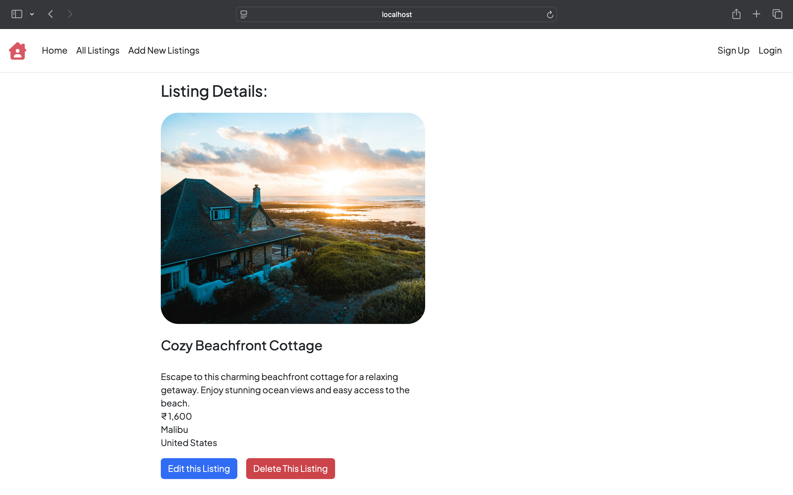
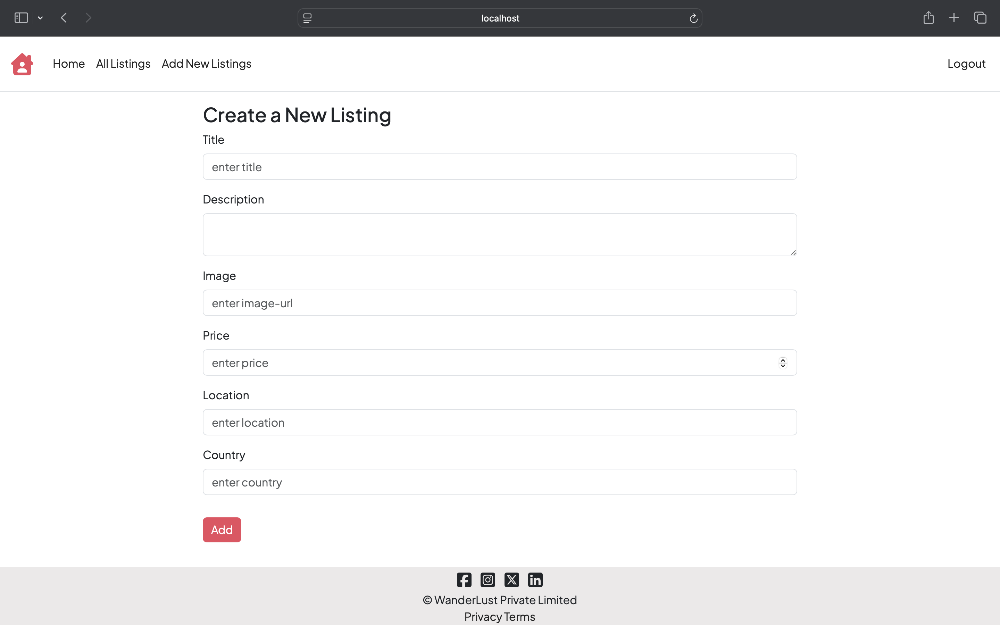
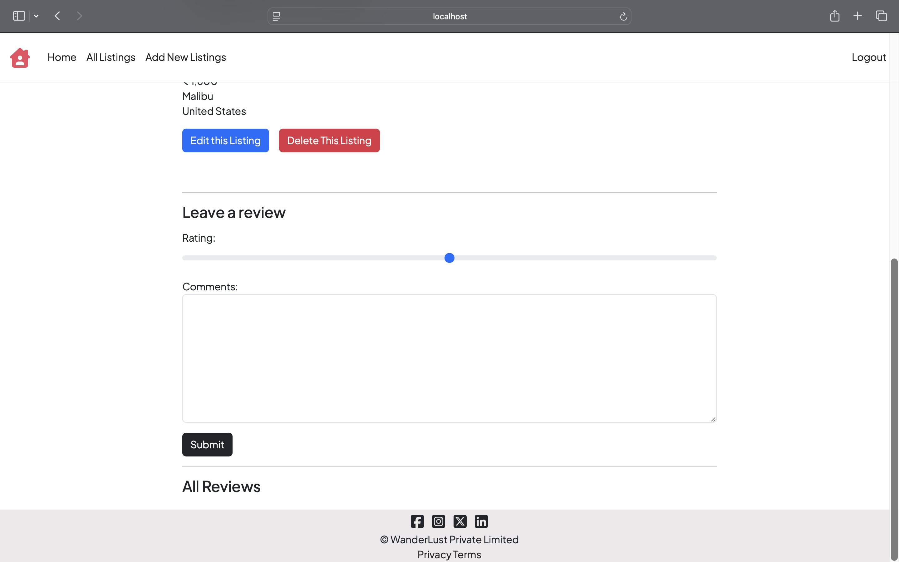

# TripNest

TripNest is a web application for browsing accommodation listings, designed to provide a modern and intuitive booking experience.

## Current Features
- View property listings with images and details
- Add new property listings as a host
- Add and Delete reviews for better experience

## Future Enhancements
- Search and filter by location  
- User authentication & authorization   

## Tech Stack
- **Frontend:** Bootstrap, HTML5, CSS3, JavaScript ,React(in Future)
- **Backend:** Node.js, Express.js  
- **Database:** MongoDB  
- **Other Tools:** Git, GitHub  

## Getting Started
Here are some screenshots of the TripNest application:

### Home Page  
  

### Property Listing Page  
  

### Adding a Listing Page 
  

### Review Section  
  

### Installation
```bash
git clone https://github.com/Kunjika-Gupta/TripNest.git
cd TripNest
npm install
npm start

